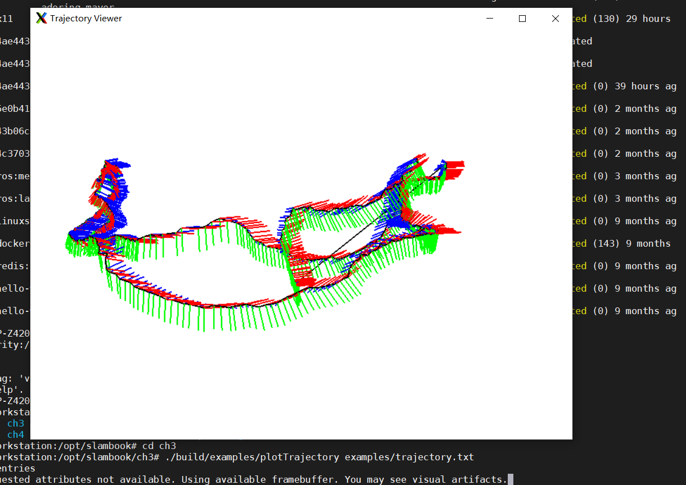

## Docker Container for Slambook2

This repo is docker container for slambook2. Our goal is to reduce the inconvenience of building your demo environment. With docker you can do it out of the box. You do not worry about making your current build environment dirty. Pre-installed packages include:

- OpenCV 3.1.0
- Sophus
- Ceres
- g2o
- libeigen3-dev
- gtest
- pcl
- Pangolin

## Installation

### build through Dockerfile

```
git clone https://github.com/HomeLH/slambook2-docker.git
cd slambook2-docker
git submodule update --init
docker build -t slambook:v0.1 .
```

### pull from hub.docker.com

```
docker pull ddhogan/slambook
```

### Usage

Current version is tested at a remote ubuntu server. The ssh Client we used is MobaXterm on windows 10, which has built-in X11-server and X11-forwarding.

start docker container.

```
docker run -it \
  --net=host \
  -e DISPLAY=$DISPLAY \
  -v $HOME/.Xauthority:/root/.Xauthority \
  --name slamtest \
  slambook:v0.1
```

reenter docker container

```
# start container
docker start slamtest
# enter container
docker exec -it \
  -e DISPLAY=$DISPLAY \
  slamtest \
  bash
```

GUI test result with MobaXterm



### Known issues

- ch8 needs OpenCV 4.0, current project does not support.
- ch13 meets build error.
- Some datasets are not provided in this container.
- Switch access between remote and local desktop meets problem.
